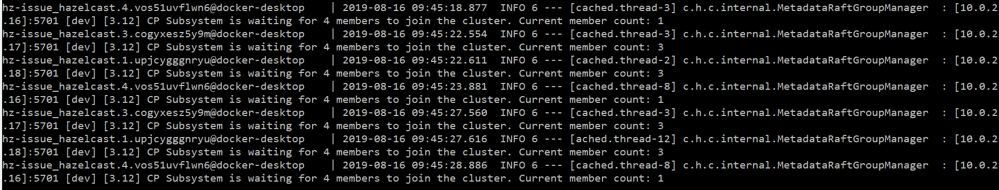

# About this repository

This repository was created to demonstrate an issue in Hazelcast CPSubsystem. The original code is 
a copy of [this example](https://github.com/hazelcast/hazelcast-code-samples/tree/master/hazelcast-integration/eureka/springboot-embedded).
(The copied state was [this commit](https://github.com/hazelcast/hazelcast-code-samples/commit/ee34ba8f260deb0befa1b39866161949b334f535)).

## How to use

1. build the projects with  `./gradlew build`
2. build the images with `docker-compose build`
3. start a docker-swarm with `docker swarm init` command (later you can destroy it with `docker swarm leave --force`)
4. deploy the claster with `docker stack deploy --compose-file docker-compose.yml hz-issue` (in the end you can remove the cluster with `docker stack rm hz-issue`)
5. in the end you will have eureka on port: **8761** and the hazelcast example on port: **8080**
6. you can put entries to a map with url: `http://localhost:8080/put?key=some-key&value=some-value` and read them with `http://localhost:8080/get?key=some-key`
7. you can modify the same map guarded by hazelcast CPSubsystem locks with: `http://localhost:8080/lock-put?key=some-key&value=some-value` and `http://localhost:8080/lock-get?key=some-key`

## Modifications to the original example

In class [Application](https://github.com/zebalu/hazelcast-eureka-swarm-issue/blob/master/hazelcast-separate-client/src/main/java/com/hazelcast/samples/eureka/Application.java) 
CPSubsystem is configured to have 4 members and 3 members shuld form the groups. Also: url of eureka is 
changed from `localhost` to the service name in the swarm. Networking interface was set to be `10.0.*.*`
so hazelcast registers the swarm network interface to eureka and the nodes can talk.

We have new endpoints 
with locks, defined in [LockCommandController](https://github.com/zebalu/hazelcast-eureka-swarm-issue/blob/master/hazelcast-separate-client/src/main/java/com/hazelcast/samples/eureka/LockCommandController.java)
which uses locks from CPSubsystem.

## How the issue shows itself

Sometimes when the nodes start, CPSubsystem can not form a cluster. The 4 members can form 2 clusters 
(2 with 2 members _or_ 1 with 1 meber and 1 with 3 members) and can not provide you a lock. You will see
a lot of `CP Subsystem is waiting for 4 members to join the cluster. Current member count: 2` log 
messages, or like this:

It seems that hazelcast can never recover from a state like this.

